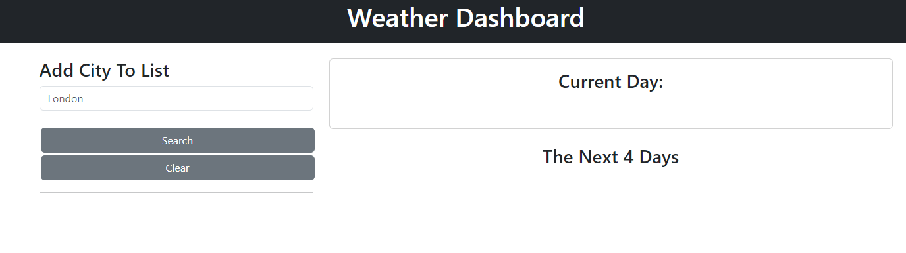
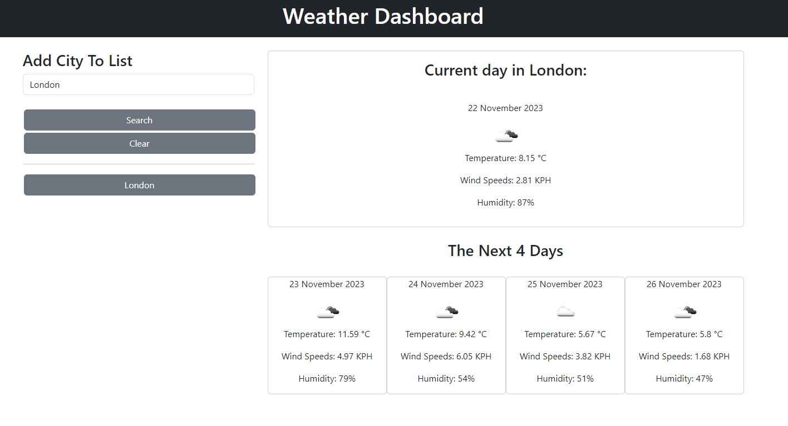

# Weather-Dashboard

## Description

This is a web application allows users to plan holidays or trips based off of the next 5 days. The weather information is displayed are temperature, wind speed, and humidity. The user is able to search multiple cities as well as clear the search history if needed, making planning easier than searching mutiple times on google.

## Usage

Steps:
1. Open link below
2. Enter in the desired City
3. Press the button that is generated
4. View the weather for the next 5 days

The website can be accessed here: https://moh-zaman.github.io/Weather-Dashboard/

   
## Credits

I have used stacked overflow to formulate some of my understandings on making APIs functional. However, most of this was done individually.

## License

MIT License provided in Repo
